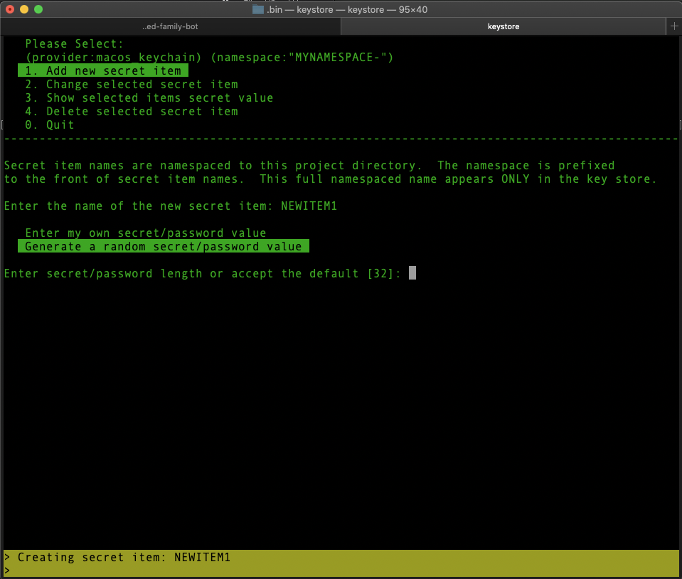

# app-secret-store

* This is a simple command line wrapper script to manage custom app keys, secrets and passwords.  The typical use case for this tool is when you have code you need to commit to a git repo but you don't want to put your private passwords/keys in git (**and you shouldn't**).  It's easy enough to put the passwords/keys in a file that you exclude from git but now you have your important keys sitting all through your system in source code folders.  This wrapper script allows you to quickly add, change, view and delete passwords/keys from your favorite key storage system.  MacOS KeyChain 
plugin is enabled by default but other provider plugins can be added (e.g. [BitWarden](https://bitwarden.com/), [Azure Key Vault](https://docs.microsoft.com/en-us/azure/key-vault/general/overview), or [AWS Key Management Service](https://aws.amazon.com/kms/) or any other password/key management tool that has a command line interface).

* Make sure the keystore file is your PATH or symlink it to a file in your PATH. Also make sure 
to copy the lib sub-folder as well.  

* Can be run from the command line e.g. ```keystore add MYKEYNAME MYPASSWORD``` or run from the menu system
by running just ```keystore``` with no parameters.

* Running the keystore menu system will look for a .keystore file in the folder its run from.  If it's not there it will create an empty one.  This file contains the password variable names you want to manage for the project located in this folder.

* For [Z shell](https://en.wikipedia.org/wiki/Z_shell) users there is an autocompletions file included.  Make sure to copy the _keystore file to your $ZSH_COMPLETIONS_DIR directory.



__*note: On MacOS if you see odd screen artifacts you may need to update the ncurses package. e.g. using brew: ```brew install ncurses```*__
